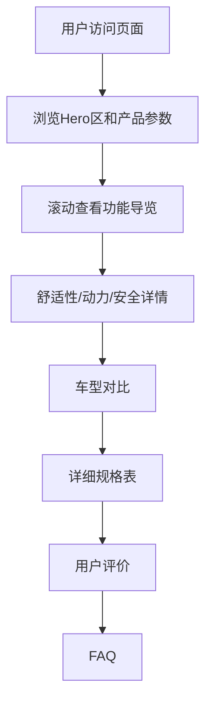

## 1. 产品概述

Velotric Discover 3 电动自行车产品展示页面的完整复刻，包含所有产品信息、交互动效和视觉设计。部署在 GitHub Pages 上，方便分享和修改。

- 目标：1:1 还原 Velotric Discover 3 产品页的所有内容和动效，图片资源集中管理便于替换
- 目标用户：需要展示产品页面的个人用户，可通过 GitHub Pages 分享链接

## 2. 核心功能

### 2.1 页面模块

1. **产品展示页**：完整的产品详情页，包含所有区块

### 2.2 页面详情

| 页面名称 | 模块名称 | 功能描述 |
|---------|---------|---------|
| 产品展示页 | 顶部导航栏 | 品牌Logo、导航链接、购物车图标 |
| 产品展示页 | Hero 产品区 | 产品图片轮播（14张）、360°查看、产品标题、评分、价格、尺寸/颜色选择器、核心参数（续航/速度/传感器/电池/电机/助力模式）、购买按钮 |
| 产品展示页 | 信任徽章 | 1200+经销商、UL安全认证、IPX防水 |
| 产品展示页 | 包装箱内容 | 产品清单展示 |
| 产品展示页 | 引导式功能导览 | 交互式自行车热点标注，点击展示功能详情视频 |
| 产品展示页 | ComfortMax™ 舒适性 | 舒适科技介绍、用户评价、鞍座进化对比（Gen1/Gen2/Gen3） |
| 产品展示页 | 强劲动力 | 电机参数展示（750W/1100W峰值/75Nm）、续航里程 |
| 产品展示页 | 多地形适应 | 铺装路面/爬坡/碎石路面图片展示 |
| 产品展示页 | 安全标准 | UL2271/UL2849认证、IPX7/IPX6防水 |
| 产品展示页 | 行业领先组件 | 轮胎/刹车/车灯等组件展示 |
| 产品展示页 | 专家评测 | 专家评价引用、视频评测 |
| 产品展示页 | 对比选择 | Discover 3 vs Discover M 对比表 |
| 产品展示页 | 详细规格 | 完整规格参数表（车架/前叉/电机/电池等） |
| 产品展示页 | 用户评价 | 评分统计、评价列表 |
| 产品展示页 | 常见问题 | FAQ 手风琴展开 |
| 产品展示页 | 页脚 | 品牌信息、链接、社交媒体、订阅 |

## 3. 核心流程

用户访问页面 → 浏览产品图片和核心参数 → 滚动查看功能亮点 → 查看舒适性和动力详情 → 对比车型 → 查看规格 → 阅读评价 → 了解FAQ

## 4. 用户界面设计

### 4.1 设计风格

- 主色调：深灰黑 (#1a1a1a) + 品牌蓝绿 + 白色
- 辅助色：暖棕色 (#96775e)、金色强调 (#ffe664)
- 按钮风格：圆角胶囊按钮，主要操作为实心填充
- 字体：Manrope 字体族（与原站一致）
- 布局：全宽区块，内容居中，大量留白
- 动效：滚动渐入、热点脉冲动画、图片视差、轮播切换

### 4.2 页面设计概览

| 页面名称 | 模块名称 | UI元素 |
|---------|---------|--------|
| 产品展示页 | Hero区 | 左侧图片轮播+右侧产品信息，淡入淡出切换 |
| 产品展示页 | 功能导览 | 全宽视频+热点标注，脉冲动画圆点 |
| 产品展示页 | 舒适性 | 左右分栏图文，滚动渐入动画 |
| 产品展示页 | 动力区 | 大数字参数展示+背景视频/图片 |
| 产品展示页 | 安全认证 | 三列卡片网格，图标+文字 |
| 产品展示页 | 对比表 | 双列对比表格，高亮差异 |
| 产品展示页 | 规格表 | 分组折叠式规格列表 |

### 4.3 响应式

- 桌面优先设计（1440px基准）
- 平板适配（768px断点）
- 移动端适配（375px断点）
- 图片使用响应式尺寸

### 4.4 图片管理

- 所有图片URL集中在 `src/config/images.ts` 中管理
- 替换图片只需修改该配置文件
- 图片使用 CDN 占位，可随时替换为本地图片
