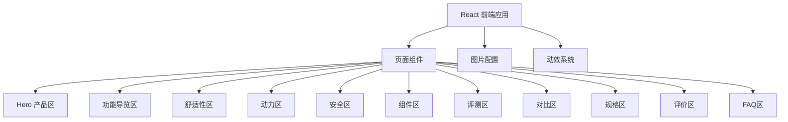

## 1. 架构设计



## 2. 技术说明

- 前端：React@18 + TypeScript + Tailwind CSS@3 + Vite
- 初始化工具：vite-init
- 后端：无（纯静态部署）
- 部署：GitHub Pages（使用 gh-pages 包）
- 动效：CSS 动画 + Intersection Observer API 实现滚动触发
- 图片管理：集中配置文件，方便替换

## 3. 路由定义

| 路由 | 用途 |
|------|------|
| / | 产品展示主页 |

## 4. 项目结构

```
src/
├── config/
│   └── images.ts          # 所有图片URL集中管理
├── components/
│   ├── Navbar.tsx          # 顶部导航
│   ├── HeroSection.tsx     # Hero产品区
│   ├── TrustBadges.tsx     # 信任徽章
│   ├── BoxContent.tsx      # 包装箱内容
│   ├── GuidedTour.tsx      # 交互式功能导览
│   ├── ComfortSection.tsx  # 舒适性区域
│   ├── PowerfulSection.tsx # 动力区域
│   ├── TerrainSection.tsx  # 多地形区域
│   ├── SafetySection.tsx   # 安全认证区域
│   ├── ComponentsSection.tsx # 组件展示
│   ├── ExpertReviews.tsx   # 专家评测
│   ├── ComparisonTable.tsx # 对比表格
│   ├── Specifications.tsx  # 规格参数
│   ├── UserReviews.tsx     # 用户评价
│   ├── FAQ.tsx             # 常见问题
│   └── Footer.tsx          # 页脚
├── hooks/
│   ├── useScrollAnimation.ts # 滚动动画Hook
│   └── useIntersection.ts   # 交叉观察器Hook
├── App.tsx
└── main.tsx
```

## 5. 动效实现方案

- **滚动渐入**：使用 Intersection Observer，元素进入视口时添加 CSS class 触发动画
- **热点脉冲**：CSS @keyframes 实现圆点脉冲扩散效果
- **图片轮播**：CSS transform + transition 实现滑动切换
- **数字递增**：requestAnimationFrame 实现数字从0递增到目标值的动画
- **视差滚动**：CSS transform: translateY 基于滚动位置偏移
